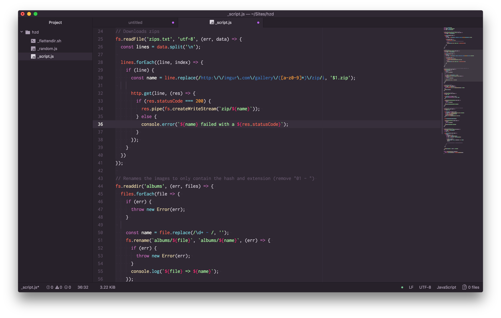

## [Calamity Theme for Atom](https://atom.io/themes/calamity-syntax)

> A purple dark theme with medium to high contrast for the [Atom editor](https://atom.io)




## Supported languages

- JavaScript
- CSS
  - SCSS
  - Sass
  - Less
- HTML
- GitHub Flavoured Markdown
- JSON
- PHP
- SQL
- Pug / Jade
- Python
- Java

## Supported applications

Also available for:

- [VSCode](https://marketplace.visualstudio.com/items?itemName=Pustur.calamity-vscode)
- [Sublime Text](https://github.com/Pustur/calamity-sublime)
- [iTerm2](https://github.com/mbadolato/iTerm2-Color-Schemes#calamity)

## Install

```
apm install calamity-syntax
```

## Contributing

If you want more languages a PR is always welcome! 🙂

## License

[MIT](https://github.com/Pustur/calamity-atom/blob/master/LICENSE.md)
